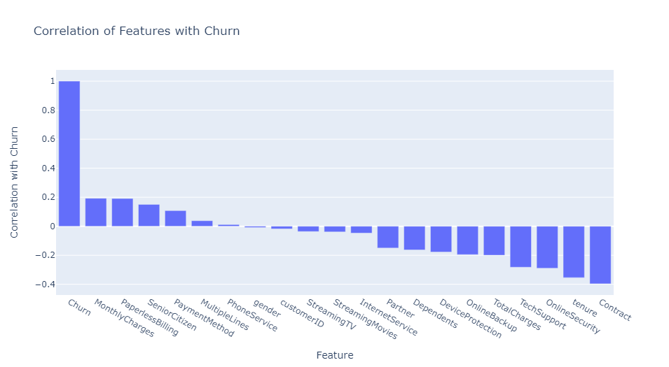

## Sreesai Sameera Koppana, Spring_2024

# Title and Author
 - **Project Title:** Telecom Customer Churn Prediction
 - Prepared for UMBC Data Science Master Degree Capstone by Dr Chaojie (Jay) Wang
 - **Author:** Sreesai Sameera Koppana
 - **GitHub Profile:** https://github.com/Sameera312001
 - **Github Project Link:** https://github.com/Sameera312001/UMBC-DATA606-Capstone
 - **Final Presentation Link:** 
 - **Youtube Video Link:** 
 - **LinkedIn Profile:** https://www.linkedin.com/in/sameerakoppana/

# Background
- In the dynamic landscape of the telecommunications industry, customer churn presents a formidable challenge for service providers. With an annual churn rate ranging from 15-25 percent, companies face the constant threat of losing customers to competitors in this fiercely competitive market. Despite recognizing the importance of individualized customer retention efforts, the sheer scale of customer bases makes it impractical for firms to dedicate significant resources to each customer. However, by identifying high-risk clients—those likely to churn—companies can strategically focus retention efforts to maximize revenue and minimize costs.

- To effectively combat churn, telecom companies must adopt a holistic approach to understanding customer behavior across multiple touchpoints. By analyzing customer interactions such as store visits, purchase histories, customer service calls, online transactions, and social media engagement, companies can gain valuable insights into potential churn indicators. This comprehensive view enables proactive intervention to mitigate customer attrition and preserve market position.

- Moreover, addressing churn not only safeguards existing market share but also paves the way for growth and profitability. As companies retain more customers within their network, the cost of customer acquisition decreases, and profitability increases. Therefore, reducing client attrition and implementing effective retention strategies emerge as pivotal factors for success in the telecommunications industry. By leveraging predictive analytics and actionable insights, companies can cultivate customer loyalty, drive sustainable growth, and thrive in this competitive landscape.

# Data
- **Data Source:** Kaggle
- **Data Size:** 955 KB
- **Data Shape:** 7044*21
- Each row represents customer
- **Data type:** Numerical and Categorical
- **Target:** Churn

# Data Elements
- **customerID:** Unique identifier for each customer.
- **gender:** Gender of the customer (categorical: "Male" or "Female").
- **SeniorCitizen:** Whether the customer is a senior citizen (binary: 0 for No, 1 for Yes).
- **Partner:** Whether the customer has a partner (binary: "Yes" or "No").
- **Dependents:** Whether the customer has dependents (binary: "Yes" or "No").
- **tenure:** Number of months the customer has been with the company (numerical).
- **PhoneService:** Whether the customer has a phone service (binary: "Yes" or "No").
- **MultipleLines:** Whether the customer has multiple lines (categorical: "Yes", "No", or "No phone service").
- **InternetService:** Type of internet service the customer has (categorical: "DSL", "Fiber optic", or "No").
- **OnlineSecurity:** Whether the customer has online security service (categorical: "Yes", "No", or "No internet service").
- **OnlineBackup:** Whether the customer has online backup service (categorical: "Yes", "No", or "No internet service").
- **DeviceProtection:** Whether the customer has device protection service (categorical: "Yes", "No", or "No internet service").
- **TechSupport:** Whether the customer has tech support service (categorical: "Yes", "No", or "No internet service").
- **StreamingTV:** Whether the customer has streaming TV service (categorical: "Yes", "No", or "No internet service").
- **StreamingMovies:** Whether the customer has streaming movie service (categorical: "Yes", "No", or "No internet service").
- **Contract:** Type of contract the customer has (categorical: "Month-to-month", "One year", or "Two year").
- **PaperlessBilling:** Whether the customer uses paperless billing (binary: "Yes" or "No").
- **PaymentMethod:** Payment method used by the customer (categorical: "Electronic check", "Mailed check", "Bank transfer (automatic)", or "Credit card (automatic)").
- **MonthlyCharges:** Monthly charges for the customer (numerical).
- **TotalCharges:** Total charges for the customer (numerical).
- **Churn:** Whether the customer churned (binary: "Yes" or "No").

# Results Of EDA
- In my dataset, I encountered 11 missing values in the 'TotalCharges' column. Notably, the 'tenure' value for these entries was also 0, despite the 'MonthlyCharges' column containing non-empty values. To ensure data integrity, I opted to remove these 11 rows from the dataset. With this adjustment, my dataset is now considered clean and ready for further analysis. Subsequently, I proceeded to conduct visualizations, preprocessing steps, and summary statistics to gain deeper insights into the data.
- **Summary Statistics**
  - SeniorCitizen:
    - Count: 7,032
    - Mean: 0.1624
    - Standard Deviation: 0.3688
    - Minimum: 0
    - 25th Percentile (Q1): 0
    - Median (50th Percentile): 0
    - 75th Percentile (Q3): 0
    - Maximum: 1
  - **tenure**
    - Count: 7,032
    - Mean: 32.4218
    - Standard Deviation: 24.5453
    - Minimum: 1
    - 25th Percentile (Q1): 9
    - Median (50th Percentile): 29
    - 75th Percentile (Q3): 55
    - Maximum: 72
  - **MonthlyCharges**
    - Count: 7,032
    - Mean: 64.7982
    - Standard Deviation: 30.0860
    - Minimum: 18.25
    - 25th Percentile (Q1): 35.5875
    - Median (50th Percentile): 70.35
    - 75th Percentile (Q3): 89.8625
    - Maximum: 118.75
  - **TotalCharges**
    - Count: 7,032
    - Mean: 2,283.3004
    - Standard Deviation: 2,266.7714
    - Minimum: 18.8
    - 25th Percentile (Q1): 401.45
    - Median (50th Percentile): 1,397.475
    - 75th Percentile (Q3): 3,794.7375
    - Maximum: 8,684.8
- **Data Visualizations**
- **Correlation of Features w.r.t Churn**
  - From the customer churn correlation matrix, I observed that customers who have features associated with higher spending, like long contracts (Contract tenure) and bigger bills (TotalCharges, MonthlyCharges), tend to churn more. This suggests a potential disconnect between these plans and customer needs. On the other side, customers who use additional services like online security (OnlineSecurity), phone service (PhoneService), and multiple phone lines (MultipleLines) seem less likely to churn. This implies that these services might increase customer satisfaction and loyalty.
 

- **Data Preprocessing**
  - I preprocessed the dataset by encoding object-type variables to integers using LabelEncoder and standardizing numerical features via StandardScaler. Following this, I categorized the data into three groups: numerical columns, categorical columns for One-Hot Encoding, and categorical columns for Label Encoding. After segmentation, I applied StandardScaler to both training and testing sets for consistent scaling. Lastly, I verified class balance by examining churn and no-churn counts, ensuring a balanced dataset for unbiased model evaluation and decision-making.

# Results of ML
- **AdaBoost Classifier**
  - Accuracy: 0.811
  - Best Hyperparameters: {'learning_rate': 0.05, 'n_estimators': 200}
  - Test Accuracy: 0.812
  - Mean Cross-Validation Score: 0.797
- **Random Forest Classifier**
  - Accuracy: 0.801
  - Best Hyperparameters: {'max_depth': 10, 'min_samples_split': 10, 'n_estimators': 100}
  - Test Accuracy: 0.808
- **Logistic Regression**
  - Accuracy: 0.809
  - Best Hyperparameters: {'C': 0.1, 'penalty': 'l2'}
  - Test Accuracy: 0.808
  - Mean Cross-Validation Score: 0.789
- **Gradient Boosting Classifier**
  - Accuracy: 0.805
  - Best Hyperparameters: {'learning_rate': 0.1, 'max_depth': 5, 'min_samples_leaf': 2, 'min_samples_split': 5, 'n_estimators': 50}
  - Test Accuracy: 0.808
- **Voting Classifier**
  - Accuracy: 0.807
  - Best Hyperparameters: {'gb__n_estimators': 50, 'lr__C': 10, 'rf__n_estimators': 100}
  - Test Accuracy: 0.808
  - Mean Cross-Validation Score: 0.802
- After evaluating multiple models including AdaBoost, Random Forest, Logistic Regression, Gradient Boosting, and a Voting Classifier, it's evident that AdaBoost outperforms the others in both overall accuracy and recall for class 1. While Random Forest and Logistic Regression show competitive performance, they struggle in correctly identifying positive cases. Similarly, Gradient Boosting, despite its high accuracy, faces similar challenges. The Voting Classifier, leveraging a combination of models, offers comparable accuracy to AdaBoost but with slightly lower precision and recall. Consequently, AdaBoost emerges as the optimal choice for this task.

# Conclusion
In conclusion, this analysis explored various machine learning models for predicting customer churn in the telecom industry. Through rigorous evaluation and comparison of AdaBoost, Random Forest, Logistic Regression, Gradient Boosting, and a Voting Classifier, AdaBoost emerged as the most effective model for the task at hand. With its superior overall accuracy and class 1 recall, AdaBoost offers a robust solution for identifying and mitigating customer churn. The findings underscore the importance of employing advanced machine learning techniques to address complex business challenges and enhance customer retention strategies in highly competitive markets. Moving forward, leveraging AdaBoost as a predictive tool can empower telecom companies to proactively identify at-risk customers and implement targeted retention efforts, ultimately driving business growth and fostering long-term customer satisfaction.